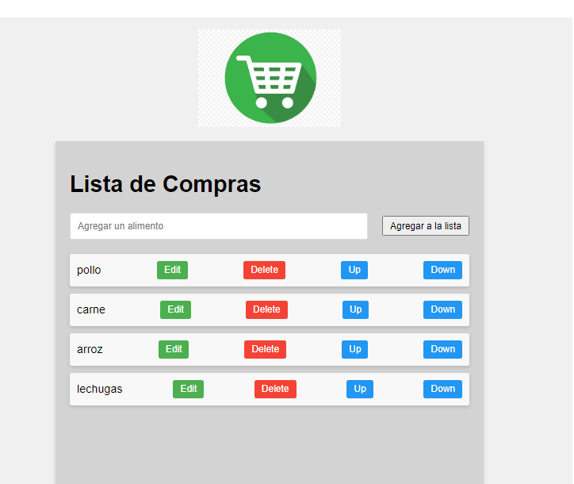
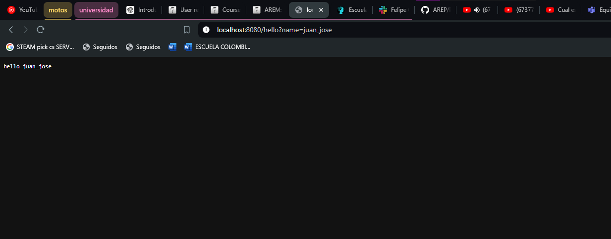
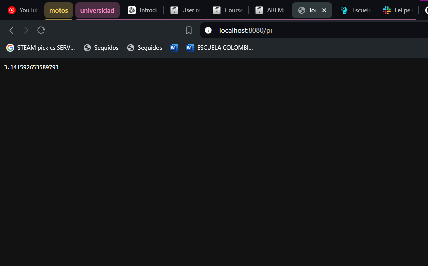

# Taller 2 AREM

Este proyecto tiene como objetivo mejorar un servidor web existente, que actualmente soporta archivos HTML, JavaScript, CSS e imágenes, convirtiéndolo en un marco web completamente funcional. Este marco permitirá el desarrollo de aplicaciones web con servicios REST en el backend. El nuevo marco proporcionará a los desarrolladores herramientas para definir servicios REST utilizando funciones lambda, gestionar valores de consulta dentro de las solicitudes y especificar la ubicación de los archivos estáticos.

# Arquitectura
El proyecto tiene una arquitectura Cliente-Servidor con los siguientes componentes:

1. Cliente: El cliente es una aplicación web construida con HTML, CSS y JavaScript. El código del cliente se encuentra en el directorio src/webroot. El archivo index.html es la página principal de la aplicación, y app.js contiene el código JavaScript que maneja la interactividad de la página. Los archivos estáticos (como imágenes y CSS) también se sirven desde este directorio.  
2. Servidor: El servidor es una aplicación Java que maneja las solicitudes HTTP de manera concurrente. El código del servidor se encuentra en el directorio src/main/java/org/example. La clase SimpleHttpServer es el punto de entrada principal del servidor. Esta clase inicia un servidor HTTP en el puerto 8080 y maneja las solicitudes GET, POST y DELETE en hilos separados, permitiendo así el manejo concurrente de múltiples solicitudes.  
3. Construcción y despliegue: El proyecto utiliza Maven para la construcción y el despliegue. Los archivos en src/main/resources se incluyen en el classpath de la aplicación durante la fase de compilación de Maven.

En términos de patrones de diseño, el servidor ahora sigue el patrón de diseño multihilo, donde cada solicitud HTTP entrante se maneja en su propio hilo, permitiendo así el procesamiento concurrente de múltiples solicitudes.
# Instrucciones

Este documento proporciona instrucciones paso a paso para instalar y ejecutar el programa.

## Instalar el aplicativo web

1. Abre una terminal.
2. Navega al directorio donde deseas clonar el repositorio.
3. Ejecuta el siguiente comando para clonar el repositorio:

```bash
git clone https://github.com/username/repository.git
```
4. Abre el directorio del repositorio clonado en tu IDE favorito.
5. Dentro de tu IDE favorito ejecuta el siguiente comando para instalar el proyecto:
```bash
mvn clean install
```
6. El proyecto está listo para ser ejecutado desde la clase SimpleHttpServer e ingresando al enlace: http://localhost:8080/index.html

# Demostración de las implementaciones:
Aqui podemos ver en acción el mecanismo que extrae los parametros de busquedas, en este caso la variable name y tambien la implementación de el número pi


